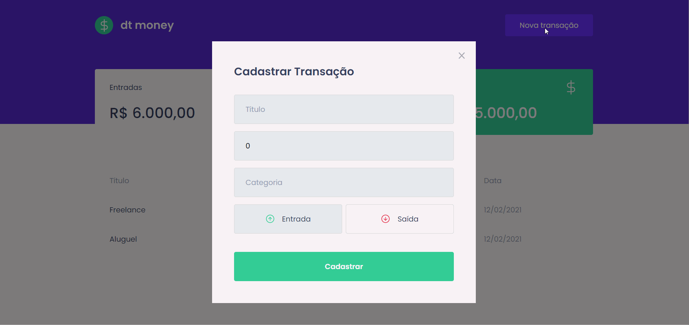

<h1 align="center">
Dt Money
</h1>
<h2 align="center">Aplicação de controle de finanças.</h2>



---
## ⚡ Tecnologias Utilizadas

- ReactJS + hooks
- Typescript
- SASS + Styled Components
- MirageJS + Axios

---
## 🚀 Começando!

### 1. Clone!

  ```git clone https://github.com/davim5/dtmoney-react.git```

### 2. Acesse a pasta do projeto!

  ```cd GoFinances```

### 3. Instale as dependências!

  ```yarn```

### 4. Rode!

  ```yarn start```

### 5. Aproveite!
---
## 📌 Contato
Me encontre em uma dessas redes!

[](https://www.linkedin.com/in/davilima5/)
[](https://github.com/davim5)

Made with ♥ Enjoy it!


